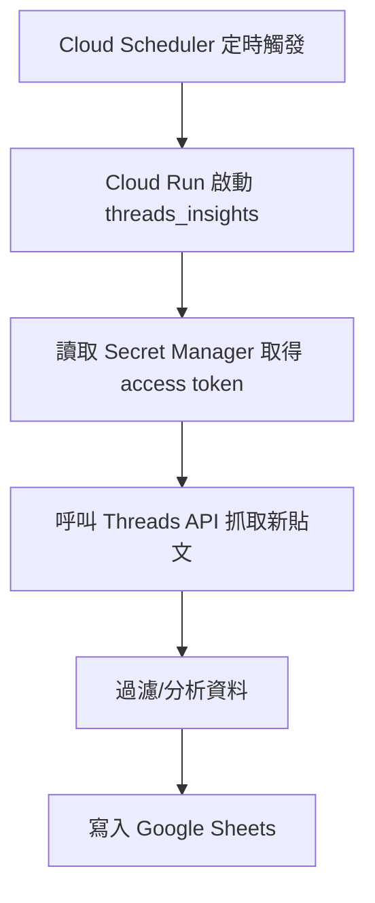

# Threads Insights

## 專案目的

本專案自動化收集 Instagram Threads 帳號的貼文與互動數據，並將最新資料自動寫入 Google Sheets，方便後續分析與報表製作。

---

## 運用到的 GCP 服務

- **Cloud Scheduler**
  - 定時排程觸發 Cloud Run Job。
- **Cloud Run**
  - 執行本專案的 Node.js 程式，負責抓取 Threads 貼文、分析、寫入 Google Sheets。
- **Google Secret Manager**
  - 安全儲存 Threads API 的 access token 及 Google Sheets 服務帳戶金鑰。
- **Google Sheets API**
  - 將分析結果寫入 Google Sheets。

---

## 運作流程

---

## 核心設計重點

- **自動化**：無需人工操作，定時自動執行。
- **增量更新**：只寫入自上次執行後的新貼文，避免重複。
- **安全性**：敏感資訊（token、金鑰）全部存放於 Secret Manager。
- **彈性設定**：可用環境變數指定 Google Sheets ID、工作表名稱、日期範圍等。
- **高可用**：所有服務皆為 GCP 雲端原生，易於維運與擴展。

---

## 主要環境變數

- `SPREADSHEET_ID`：目標 Google Sheets 試算表 ID
- `SHEET_NAME`：工作表名稱（預設 ThreadsData）
- `GOOGLE_CLOUD_PROJECT`：GCP 專案 ID
- `CLOUD_RUN_JOB_NAME`：Cloud Run Job 名稱
- `CLOUD_RUN_LOCATION`：Cloud Run Job 區域（如 asia-east1）
- `SINCE_DATE`、`UNTIL_DATE`：手動指定抓取日期範圍（可選）

---

## 典型執行流程

1. Cloud Scheduler 依排程觸發 Cloud Run Job。
2. Cloud Run Job 啟動，讀取 Secret Manager 取得 Threads API token。
3. 取得上次 Scheduler 執行時間，作為抓取新貼文的起點。
4. 呼叫 Threads API，取得自上次執行後的新貼文。
5. 過濾重複、分析互動數據。
6. 將新資料寫入 Google Sheets 最上方。
7. 完成！

---

## 適用場景

- 企業/個人自動化追蹤 Threads 貼文成效
- 數據分析、報表自動化
- 雲端無伺服器架構，易於維運

---

如需詳細部署與參數設定，請參考 `DEPLOYMENT.md` 與程式內註解。